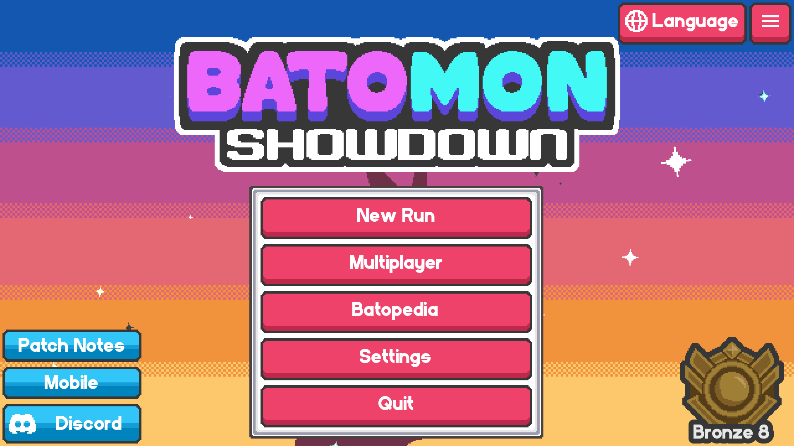
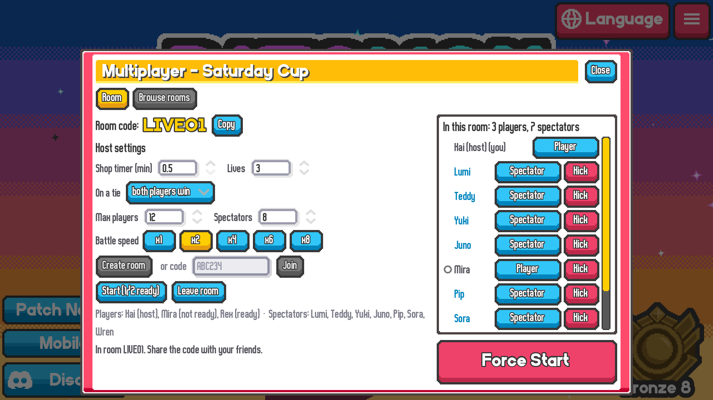
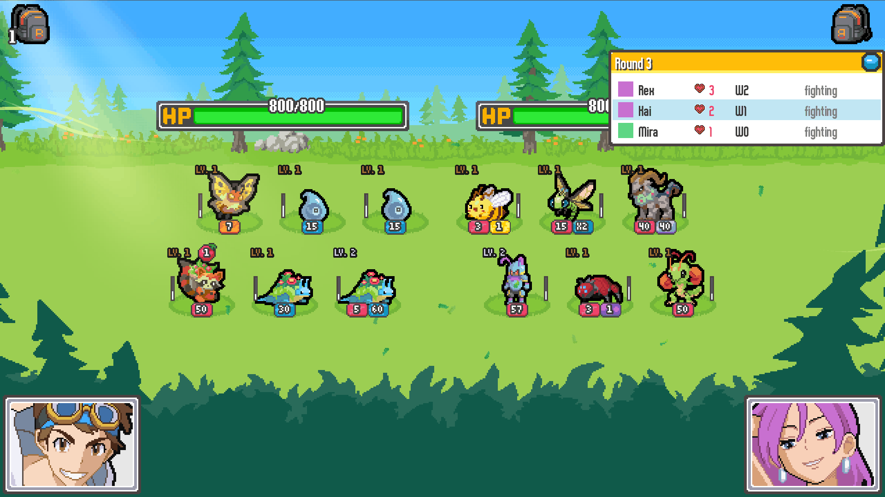
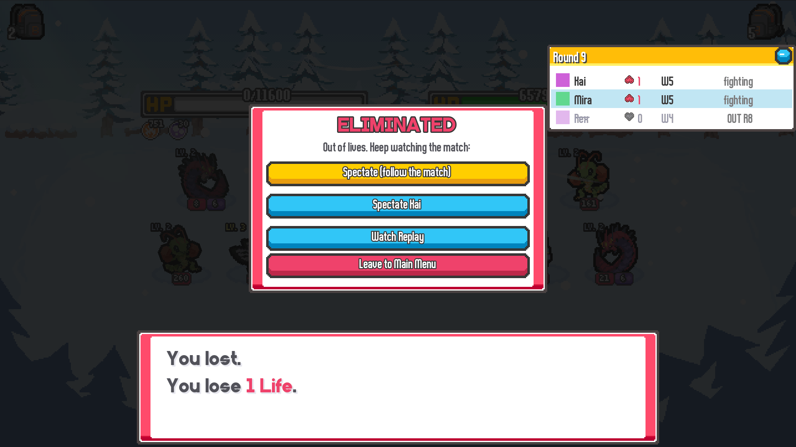
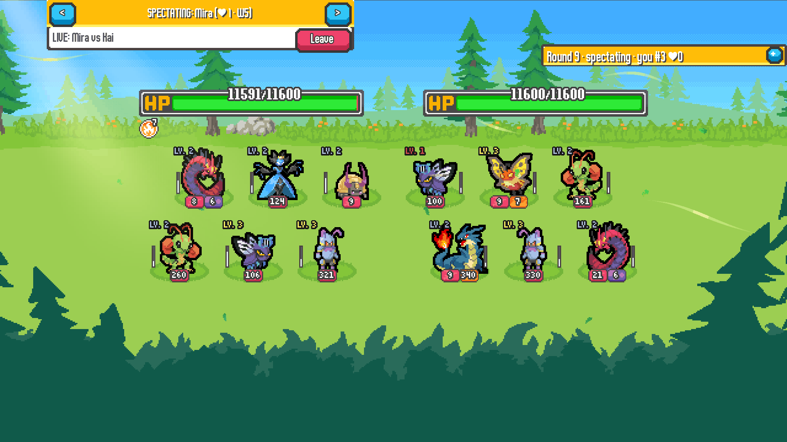

# BatoMulti — Batomon Showdown Multiplayer Mod

**Batomon Multiplayer for Steam on Windows: play Batomon Showdown with friends in private online rooms.**

BatoMulti is an unofficial Batomon Showdown multiplayer mod created and maintained by
[Maxkii3](https://github.com/Maxkii3). One player hosts a room and shares a short code.
Everyone builds their team in the shop at the same time, then battles round after round
until only one trainer is left standing. You can also join as a spectator and watch friends live.

**[Download BatoMulti](https://github.com/Maxkii3/Batomon-Multiplayer/releases)** ·
[Installation guide](#-how-to-install) ·
[Play with friends](#-how-to-play-with-friends) ·
[Report a bug](https://github.com/Maxkii3/Batomon-Multiplayer/issues)

Requires Batomon Showdown on **Steam for Windows**. Everyone playing needs the same
BatoMulti version and Steam running. This is a community mod, not an official multiplayer update.

[](https://buymeacoffee.com/maxkii3)

<div align="center">
  <a href="https://www.gsttopup.com/shop" target="_blank">
    
  </a>
  <br/>
  <sub>🎮 <b>Sponsored by / สนับสนุนโดย:</b> <a href="https://www.gsttopup.com/shop">GST Topup</a></sub>
  <br/>
  <sub><b>TH:</b> เติมเกมถูก รวดเร็ว ปลอดภัย แนะนำที่ GST Topup | <b>EN:</b> Affordable, fast, and secure game top-ups at GST Topup</sub>
</div>

---

## 📸 Preview

<table>
  <tr>
    <td width="50%"><br><sub><b>Main menu</b> — BatoMulti adds a <b>Multiplayer</b> button.</sub></td>
    <td width="50%"><br><sub><b>Lobby</b> — room code, host settings, and the room list with <b>Player / Spectator</b> roles.</sub></td>
  </tr>
  <tr>
    <td width="50%"><br><sub><b>Match</b> — everyone battles at the same time; the live leaderboard tracks lives and wins.</sub></td>
    <td width="50%"><br><sub><b>Knocked out</b> — keep watching: follow the match or pick a player.</sub></td>
  </tr>
  <tr>
    <td colspan="2"><br><sub><b>Spectator mode</b> — watch any player's shop and battles live, full screen; switch with &lt; &gt;.</sub></td>
  </tr>
</table>

---

## ✨ Cool features

- **1-click setup** — one file installs everything. Already using another mod? It's
  put safely aside and comes back exactly as it was when you uninstall.
- **Private rooms with codes** — no strangers, just your friends. Pick your own code (or keep the random
  one) and copy it with one click.
- **Speed controls** — the host picks 1x, 2x, 4x, 6x or 8x battle speed for everyone.
- **Revamped Second Chance** — the first time you hit zero lives, you're back with 1 life and pick one
  of four comebacks:
  - **Board Upgrade** — every unit on your board levels up (up to level 3)
  - **Element Infusion** — give one of your units a new element
  - **Trinket** — choose a trinket whose rarity grows with the day: Common (Day 1-2), Rare (3-5),
    Super Rare (6-10), Legendary (11-16), Mythical (17+)
  - **Scaling Gold** — a pile of gold that grows the longer the match goes
- **Know your next opponent** — the shop shows who you fight next (⚔), so you can plan your board against them.
- **Scout your opponents** — click a name on the leaderboard to peek at their 3×2 board.
- **Spectator mode** — knocked out? Your screen becomes a live broadcast of a friend's game: their shop, board and every purchase as it happens, their gift boxes as they open them, then their battle. Flip between players with < > or the arrow keys.
- **Join as a Spectator** — just want to watch? The room list in the lobby lets everyone pick
  **Player** or **Spectator**. Spectators watch the whole match live from round 1 and never take a
  player's spot in the fights.
- **Results screen** — see who placed where, then head back to the menu with one click.
- **Auto-reconnect** — if someone's connection drops (or the game crashes), they can jump right back
  in. If the host leaves, someone else takes over and the match keeps going.

## 📥 How to install

1. **Download `BatoMulti-Setup-0.6.6.cmd`** from the [Releases](../../releases) page.
2. **Close Batomon Showdown**, then **double-click the file** and press Enter.
   It finds your game automatically and takes care of backups.
3. **Launch the game through Steam** — the main menu now has a **Multiplayer** button. Join a room!

> Windows may say "Windows protected your PC" — click **More info → Run anyway**. The setup is a plain
> text script; you can open it in Notepad to see exactly what it does.

**To uninstall**, run the same file again. Your game (and any mod it set aside) goes back to how it
was — details in [How to uninstall](#-how-to-uninstall).

**Updates.** From 0.6.2 on, BatoMulti tells you on the main menu when a new version is out:
**[Update Now]** downloads it (checked against the release's SHA-256), **[Restart Now]** installs it and
restarts the game. Coming from 0.6.1 or older? Run the new setup file once by hand. No internet? The
check stays silent and the game starts as usual. To turn the check off, add `[update]` and
`check=false` to `%APPDATA%\Godot\app_userdata\Batomon Showdown\batomulti.cfg`.

## 🎮 How to play with friends

Everyone needs BatoMulti installed (same version) and Steam running.

- **Host:** Multiplayer → pick the shop timer, lives and battle speed → keep the random **room
  code** or type your own (4-8 letters / digits) → **Create room** → press **Copy** and send the code to your friends → **Start match** once everyone shows up.
- **Friends:** Multiplayer → type the code → **Join**.
- **Player or Spectator:** the room list on the right of the lobby shows everyone. Press your own
  **Player / Spectator** button to switch; the host can switch anyone. Roles lock when the match
  starts, and a match needs at least 2 players.
- Build your team as usual and press **Battle** when you're ready. When the timer runs out, your board
  is locked in automatically.
- **F1** opens the room panel at any time.

## Batomon Showdown multiplayer FAQ

### Can I play Batomon Showdown with friends in a private room?

Yes. With BatoMulti installed, open **Multiplayer** from the main menu. One player creates
a room and shares the room code; friends enter that code to join. A match needs at least
two players. See [How to play with friends](#-how-to-play-with-friends) for the host settings.

### Which platforms does this Batomon multiplayer mod support?

BatoMulti supports the **Steam version of Batomon Showdown on Windows**. Each player
needs the mod installed, the same mod version, and Steam running.

### Can I watch friends without joining the match?

Yes. Choose **Spectator** in the lobby before the match starts. Spectators can watch
players' shops and battles live without taking a player slot. Eliminated players can
also keep watching.

### Is BatoMulti an official Batomon Showdown update?

No. BatoMulti is an unofficial community mod maintained by Maxkii3. It is not affiliated
with or endorsed by the developers or publisher of Batomon Showdown.
For mod support, [open an issue in this repository](https://github.com/Maxkii3/Batomon-Multiplayer/issues).

## 🧹 How to uninstall

**With the setup file (recommended)**

1. Close Batomon Showdown.
2. Double-click `BatoMulti-Setup-0.6.6.cmd` again. When BatoMulti is installed, the same file
   uninstalls it (it asks first). Or run it from a command prompt with an explicit action:
   ```
   BatoMulti-Setup-0.6.6.cmd uninstall
   BatoMulti-Setup-0.6.6.cmd uninstall "D:\SteamLibrary\steamapps\common\Batomon Showdown"
   BatoMulti-Setup-0.6.6.cmd status
   ```
3. It removes the `batomulti` folder and BatoMulti's `override.cfg`, and puts back any mod it had set
   aside (checked byte for byte). Your saves are not touched.

**By hand (if the setup file is gone)**

1. Close the game. In Steam: right-click Batomon Showdown → **Manage → Browse local files**.
2. Delete the **`batomulti`** folder and the **`override.cfg`** file in that folder.
3. Only if the setup had set another mod aside: copy everything inside
   `%LOCALAPPDATA%\BatoMulti\parked\<id>\files\` back into the game folder.

**Integrity check.** BatoMulti checks its own files every time the game starts. If any of its
files were edited, it switches itself off (the game then runs normally, without multiplayer) and
shows a short notice. Fix: download the setup again from the official release and reinstall.

**Back to pure vanilla**

Delete `batomulti`, `override.cfg` (and any other mod's folder) as above, then in Steam: right-click
Batomon Showdown → **Properties → Installed Files → Verify integrity of game files**. Note: Steam's
check repairs the game's own files but does **not** delete extra files such as `override.cfg`, so
delete those first. BatoMulti never modifies the game's `.exe` or `.pck`.

## ⚠️ Unofficial mod — disclaimer

**BatoMulti is an UNOFFICIAL, third-party community mod.** It is not made, affiliated with,
sponsored, approved or endorsed by the developers or publisher of Batomon Showdown. "Batomon
Showdown" and its assets belong to their respective owners. Please do not contact the game's
developers for support with this mod.

**AS-IS, NO WARRANTY.** BatoMulti is provided "as is", without warranty of any kind, express or
implied, including fitness for a particular purpose. You install and use it entirely at your own
risk. To the fullest extent permitted by law, the author accepts **no liability** for any damage or
loss arising from its use, including but not limited to corrupted or lost save data, lost progress,
account restrictions or bans, bugs, crashes, or any other data loss. A game update can break the mod
at any time.

---

<sub>BatoMulti is an unofficial fan-made mod for Batomon Showdown (Steam, Windows). Multiplayer rooms run over
Steam between friends; matches never touch ranked play, ghosts or your saved runs.</sub>

